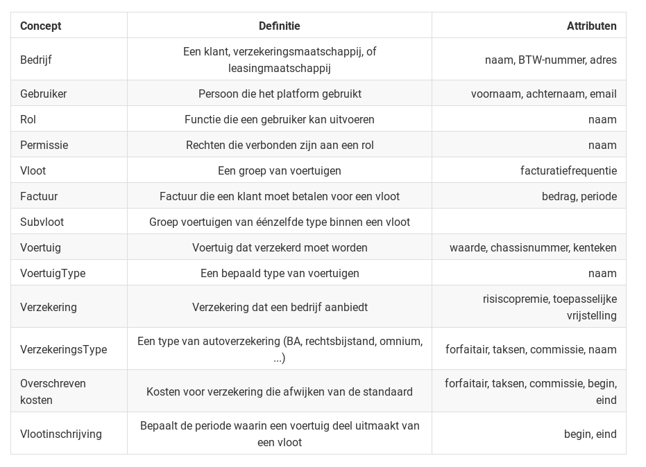
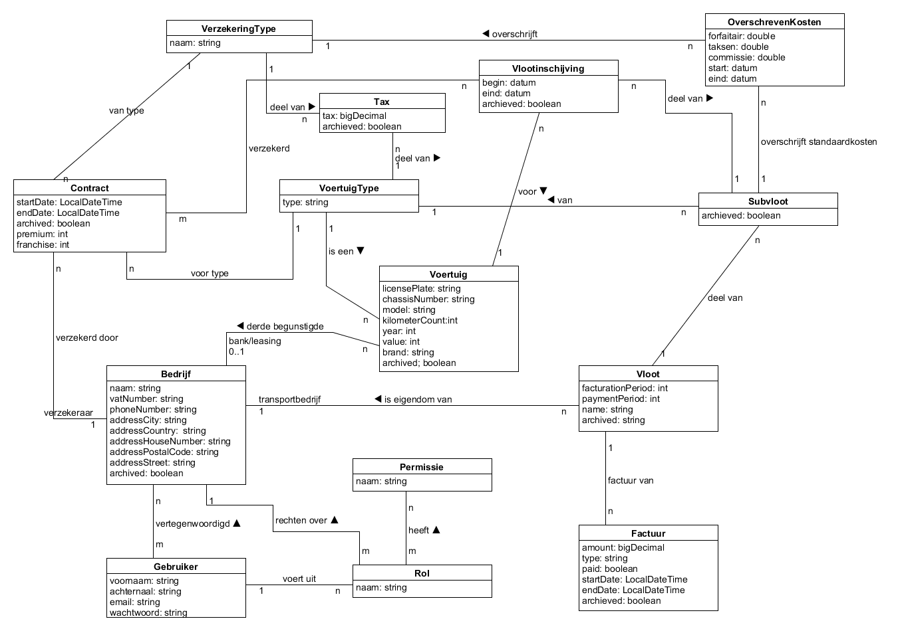

# Domeinmodel
## Concepten

### Bijkomende toelichtingen

Onder een gebruiker vallen zowel de klanten, medewerkers als administrator.
Het onderscheid tussen deze worden gerealiseerd a.d.h.v. het toekennen van permissies

Een gebruiker is via zijn rol verbonden met zijn rechten.
Klanten, verzekeraars en leasingmaatschappijen vallen samen onder het concept 'Bedrijf'. Zo kunnen we simpel voorzien dat een bedrijf meerdere types heeft. De type(s) van een bedrijf worden afgeleid uit zijn relaties. Zo is een bedrijf een verzekeraar als en slecht als dat bedrijf minstens één verzekering aanbiedt.

Voor elk concept bestaat er een log-variant, bijvoorbeeld "BedrijfsLog". Hier worden alle wijziging in opgeslagen, samen met de datum van de wijzigingen en een referentie naar de gebruiker die de wijzigingen uitvoerde. Voor de simpliciteit zijn deze echter niet opgenomen in de tabel en in de visuele voorstelling van de relaties.

## Relaties

