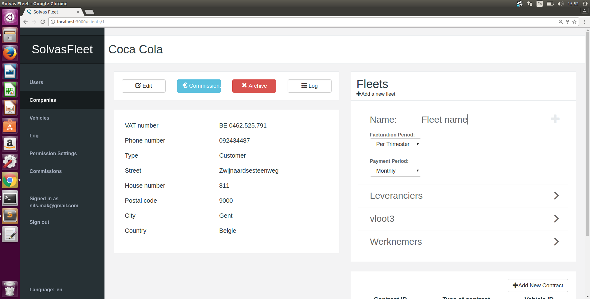

# Gebruikershandleiding bij webapplicatie SolvasFleet

## Gebruikers

### Gebruikers oplijsten

In dit scherm worden alle gebruikers opgelijst. Bij het klikken op een gebruiker wordt meer informatie over de gebruiker weergegeven naast de tabel. Het is ook mogelijk om hier de gegevens van de gebruiker te wijzigen, via de 'Edit' knop, of de gebruiker te verwijderen uit de webapplicatie, via de 'Delete' knop. Het is mogelijk om een nieuwe gebruiker toe te voegen door rechtsboven in de tabel van gebruikers op 'Add new user' te klikken.

### Gebruiker toevoegen

Bij het klikken op 'Add new user' verschijnt dit formulier. Om een nieuwe gebruiker toe te voegen vult u respectievelijk de voornaam, achternaam, het email-adres en het wachtwoord van de gebruiker in. Hiernaast is het ook mogelijk om de gebruiker permissies te verschaffen. Daarvoor vinkt u de gepaste permissies aan. De knop 'Create user' vervolledigt het toevoegproces. Na het toevoegen van een gebruiker wordt u teruggestuurd naar de lijst van gebruikers, waar de nieuwe gebruiker nu ook aan toegevoegd is.

### Gebruiker wijzigen

Bij het klikken op 'Edit' verschijnt dit formulier. De gekende gegevens van de gebruiker zijn reeds ingevuld. Het is mogelijk deze gegevens te veranderen of nieuwe gegevens toe te voegen. De knop 'Update user' vervolledigt het proces. Na het updaten van een gebruiker wordt u teruggestuurd naar de lijst van gebruikers, waar u de wijzigingen kunt waarnemen.

## Klanten

### Klanten oplijsten

In dit scherm worden alle klanten opgelijst. Bij het klikken op een klant wordt meer informatie over deze klant weergegeven. Door het klikken op 'Add new client', rechtsboven in de tabel, kan er een nieuwe klant toegevoegd worden.

### Klant weergeven

Deze pagina toont alle gegevens van de geselecteerde klant. Hier vindt u ook de opties om de gegevens van de klant te wijzigen, via de 'Edit' knop. Ook is het hier mogelijk om de klant te verwijderen, dit gebeurt via de 'Delete' knop. Op de pagina van de klant worden ook de vloten van de klant opgelijst. Bij het klikken op een vloot, worden de voertuigen van deze vloot weergegeven per type.

### Klant toevoegen

Op dit scherm wordt een formulier weergegeven waar de gegevens van een nieuwe klant ingevuld kunnen worden. Door te klikken op 'Add Client' wordt de klant opgeslagen en verschijnt deze in de lijst van klanten. Om te annuleren en terug te gaan naar de lijst van klanten zonder een klant toe te voegen drukt u op 'Cancel'.

### Klant wijzigen

Op dit scherm wordt een formulier weergegeven waar de gekende gegevens van de geselecteerde klant ingevuld zijn. Door te klikken op 'Update Client' worden de nieuwe gegevens van de klant opgeslagen. Om te annuleren en terug te gaan naar de lijst van klanten zonder wijzigingen door te voeren, drukt u op 'Cancel'.

## Vloten

### Vloot toevoegen

Om een vloot toe te voegen klikt u op 'Add a new fleet', bovenaan de tabel van vloten, op de pagina van de klant waar de vloot toegevoegd moet worden. Er opent een invoerveld waar u de naam van de vloot kan opgeven. Door op 'enter' te drukken, bevestigt u de naam van de vloot. U wordt nu doorgestuurd naar de pagina van de vloot, waar momenteel nog geen voertuigen aan toegevoegd zijn. 

## Voertuigen

### Voertuigen oplijsten

Deze pagina toont een lijst van alle voertuigen, en tot welke vloot ze behoren. Door op een voertuig te klikken wordt er naast de tabel meer informatie over het voertuig gegeven. Het is mogelijk om de voertuigen te filteren op hun type en op de vloot waarbij ze behoren. In dit scherm is het ook mogelijk de gegevens van het voertuig te wijzigen, door op 'Edit' te klikken. Het is eveneens mogelijk het voertuig te verwijderen door op de 'Delete' knop te drukken. Om een nieuwe voertuig toe te voegen, drukt u op de knop 'Add new vehicle', rechtsboven de tabel met voertuigen.

### Voertuig toevoegen

Bij het klikken op 'Add new vehicle' verschijnt dit formulier. Om een nieuw voertuig toe te voegen vult u de gegevens van het voertuig in, alsook de ID van de vloot waartoe het voertuig behoort, indien het tot een vloot behoort. De knop 'Create vehicle' vervolledigt het toevoegproces. Na het toevoegen van een voertuig wordt u teruggestuurd naar de lijst van voertuigen, waar het nieuwe voertuig nu ook aan toegevoegd is.

### Voertuig wijzigen

Bij het klikken op 'Edit' verschijnt dit formulier. De gekende gegevens van het voertuig zijn reeds ingevuld. Het is mogelijk deze gegevens te veranderen of nieuwe gegevens toe te voegen. De knop 'Update voertuig' vervolledigt het proces. Na het updaten van een voertuig wordt u teruggestuurd naar de lijst van voertuigen, waar u de wijzigingen kunt waarnemen.

