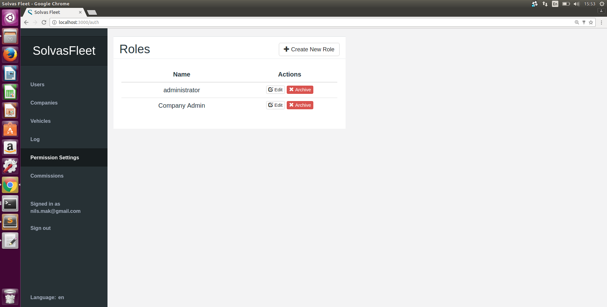

# Gebruikershandleiding bij webapplicatie SolvasFleet

## Gebruikers

### Gebruikers oplijsten

In dit scherm worden alle gebruikers opgelijst. Er kan op deze lijst gefilterd worden op voornaam, achternaam of email door de velden van de filter, bovenaan de lijst, in te vullen. Hier vindt u ook de mogelijkheid om de gebruikers te sorteren volgens id, voornaam, achternaam of email-adres en kunt u kiezen om de gearchiveerde gebruikers weer te geven door de checkbox aan te vinken. 

Bij het klikken op een gebruiker wordt meer informatie over de gebruiker weergegeven naast de tabel. Ook worden de verschillende functies van de gebruiker weergegeven. Door op `Add new function` te klikken kunnen er functies toegevoegd worden. Door in de tabel op de rode `Archive` knop te drukken worden de permissies gelinkt met die functie afgenomen van de gebruiker. Het is ook mogelijk om de gegevens van de gebruiker te wijzigen, via de `Edit` knop, de gebruiker te verwijderen uit de webapplicatie, via de `Archive` knop of de geschiedenis van een bepaalde gebruiker te bekijken via de `Log` knop. Indien een gebruiker al gearchiveerd is wordt deze knop vervangen door een `Unarchive` knop, om de gebruiker weer actief te maken. Het is mogelijk om een nieuwe gebruiker toe te voegen door rechtsboven in de tabel van gebruikers op `Add new user` te klikken.

### Gebruiker toevoegen

Bij het klikken op `Add new user` verschijnt dit formulier. Om een nieuwe gebruiker toe te voegen vult u respectievelijk de voornaam, achternaam, het email-adres en het wachtwoord van de gebruiker in. Na het toevoegen van een gebruiker wordt u teruggestuurd naar de lijst van gebruikers, waar de nieuwe gebruiker nu ook aan toegevoegd is.

### Gebruiker wijzigen

Bij het klikken op `Edit` verschijnt dit formulier. De gekende gegevens van de gebruiker zijn reeds ingevuld. Het is mogelijk deze gegevens te veranderen of nieuwe gegevens toe te voegen. De knop `Update user` vervolledigt het proces. Na het updaten van een gebruiker wordt u teruggestuurd naar de lijst van gebruikers, waar u de wijzigingen kunt waarnemen.

### Functies toekennen aan een gebruiker

Bij het klikken op `Add new function` verschijnt dit formulier. Om een nieuwe functie toe te voegen vult u de rol in en voor welke bedrijven deze gebruiker de rol kan uitoefenen, indien u `All companies` selecteert, kan de gebruiker de rol uitoefenen op alle huidige en toekomstige bedrijven. Door op `Add function` te drukken wordt de functie opgeslagen.

### Functies van een gebruiker wijzigen

Bij het klikken op een functie in de tabel van functies verschijnt dit formulier. Om een functie aan te passen verandert u de rol of de bedrijven en klikt op `Update function`.

## Klanten

### Klanten oplijsten

In dit scherm worden alle klanten opgelijst. Het is mogelijk om deze lijst te filteren op naam, VAT-nummer, land of type van bedrijf. Dit doet u door de velden in de filter in te vullen bovenaan de tabel. Hier is het ook mogelijk om de gearchiveerde bedrijven te tonen. Bij het klikken op een klant wordt meer informatie over deze klant weergegeven. Door het klikken op `Add new company`, rechtsboven in de tabel, kan er een nieuwe klant toegevoegd worden.

### Klant weergeven

Deze pagina toont alle gegevens van de geselecteerde klant. Hier vindt u ook de opties om de gegevens van de klant te wijzigen, via de `Edit` knop. Ook is het hier mogelijk om de klant te verwijderen, dit gebeurt via de `Archive` knop. Op de pagina van de klant worden ook de vloten van de klant opgelijst. Bij het klikken op een vloot, worden de voertuigen van deze vloot weergegeven per type.

### Klant toevoegen

Op dit scherm wordt een formulier weergegeven waar de gegevens van een nieuwe klant ingevuld kunnen worden. Door te klikken op `Add Client` wordt de klant opgeslagen en verschijnt deze in de lijst van klanten. Om te annuleren en terug te gaan naar de lijst van klanten zonder een klant toe te voegen drukt u op `Cancel`.

### Klant wijzigen

Op dit scherm wordt een formulier weergegeven waar de gekende gegevens van de geselecteerde klant ingevuld zijn. Door te klikken op `Update Client` worden de nieuwe gegevens van de klant opgeslagen. Om te annuleren en terug te gaan naar de lijst van klanten zonder wijzigingen door te voeren, drukt u op `Cancel`. De gegevens moeten van het juiste formaat zijn.

## Vloten

### Vloot toevoegen

Om een vloot toe te voegen klikt u op `Add a new fleet`, bovenaan de tabel van vloten, op de pagina van de klant waar de vloot toegevoegd moet worden. Er opent een invoerveld waar u de naam van de vloot kan opgeven, de facturatieperiode en de betaalperiode. Door op `enter` te drukken of te klikken op het plus-teken, bevestigt u de naam van de vloot. U wordt nu doorgestuurd naar de pagina van de vloot, waar momenteel nog geen voertuigen aan toegevoegd zijn. 

Het is mogelijk om een voertuig toe te voegen aan de vloot door op `Add a vehicle` te drukken, hier verschijnt er een inputveld waar de voertuigen die nog geen vloot hebben worden weergegeven. De voertuigen worden opgedeeld in subvloten naargelang hun type. Indien u op een voertuig klinkt krijgt u meer informatie te zien over het voertuig en kan u het aanpassen of er een contract voor opstellen. Het is mogelijk om verschillende voertuigen tegelijk te archiveren door ze aan te vinken en op de rode knop `Archive` te drukken. Het is ook mogelijk de factuur van de vloot te verkrijgen door op `Show current invoice` te klikken, of om alle facturen weer te geven via `Show all invoices`. Onder `Fleet settings` kan u de naam van de vloot, de facturatieperiode en de betaalperiode aanpassen.

## Facturen

### Facturen oplijsten

Door in het vlootscherm op `Show all invoices` te klikken worden alle facturen opgelijst, het is hier duidelijk welke facturen al betaald zijn en welke nog niet. Door op een factuur te klikken krijgt u meer informatie over de factuur te zien. Op dit scherm is het ook mogelijk een PDF af te drukken van de factuur. Leasing companies kunnen ook de factuur op 'betaald' zetten. Door in het vlootscherm op `Show current invoice` te klikken wordt de invoice van de huidige periode weergegeven.

## Voertuigen

### Voertuigen oplijsten

Deze pagina toont een lijst van alle voertuigen. Het is mogelijk deze lijst te filteren op Vehicle Identification Number, nummerplaat, vloot-id, vlootnaam of bedrijfsnaam, op type, op jaar van productie en op de naam van het verzekeringsbedrijf waar voertuigen bij verzekerd zijn. Het is ook mogelijk de gearchiveerde voertuigen weer te geven door de checkbox aan te vinken met `Show Archived`.

In de tabel wordt het bedrijf en de vloot waartoe het voertuig behoort, het Vehicle Identification Number, het nummerplaat en het type van voertuig weergegeven. Indien u op de naam van de vloot klikt wordt u doorgestuurd naar deze vloot. 

Om een nieuwe voertuig toe te voegen, drukt u op de knop `Add new vehicle`, rechtsboven de tabel met voertuigen. Het is ook mogelijk om nieuwe voertuigen toe te voegen door middel van een csv-file. Dit doet u door op `Choose File` te klikken boven de tabel. De eerste rij van de file moet de namen van de velden bevatten: vin, licensePlate, type, brand, model, fleet, mileage, value, year. De volgorde maakt hierin niets uit en enkel vin, brand, model en year zijn vereiste velden. Indien u een fout maakt wordt er een error getoond met wat de fout was en op welke rij deze voorkwam. Dit voor elke gemaakte fout. 

Door op een voertuig te klikken wordt er naast de tabel meer informatie over het voertuig gegeven. Ook worden alle contracten van het voertuig weergegeven in een tabel. Het is mogelijk om contracten toe te voegen of te raadplegen. In dit scherm is het ook mogelijk de gegevens van het voertuig te wijzigen, door op `Edit` te klikken. Het is eveneens mogelijk het voertuig te verwijderen door op de `Archive` knop te drukken. Of ze weer actief te plaatsen als ze al gearchiveerd waren door op `Unarchive` te klikken. 

### Voertuig toevoegen

Bij het klikken op `Add new vehicle` verschijnt dit formulier. Om een nieuw voertuig toe te voegen vult u de gegevens van het voertuig in, alsook de vloot waartoe het voertuig behoort, indien het tot een vloot behoort. De knop `Create vehicle` vervolledigt het toevoegproces. Na het toevoegen van een voertuig wordt u teruggestuurd naar de lijst van voertuigen, waar het nieuwe voertuig nu ook aan toegevoegd is. Let bij het toevoegen van een voertuig dan het Vehicle Identification Number zeker het goede formaat heeft (voorbeeld vin: 1HGCM563X6A052210).

### Voertuig wijzigen

Bij het klikken op `Edit` verschijnt dit formulier. De gekende gegevens van het voertuig zijn reeds ingevuld. Het is mogelijk deze gegevens te veranderen of nieuwe gegevens toe te voegen. De knop `Update voertuig` vervolledigt het proces. Na het updaten van een voertuig wordt u teruggestuurd naar de lijst van voertuigen, waar u de wijzigingen kunt waarnemen.

## Contracten

### Contracten oplijsten

Contracten worden opgelijst bij de voertuigen en bij eenderzijds het bedrijf dat het voertuig in zijn vloor heeft en anderzijds het leasing bedrijf die het voertuig bezit. Een nieuw contract toevoegen kan door op `Add new contract` te drukken bovenaan de lijst.

### Contract toevoegen

Bij het klikken op `Add new contract` verschijnt dit formulier. Om een nieuw contract toe te voegen vult u de gegevens van het contract in. De knop `Create vehicle` vervolledigt het toevoegproces. Na het toevoegen van een contract wordt u doorgestuurd naar een lijst van contracten, waar het nieuwe contract nu ook aan toegevoegd is. Let bij het toevoegen van een contract dat de start datum na vandaag ligt.

## Permissies en rollen 

### Rollen oplijsten

Bij het klikken op `Permission Settings` in de navigatiebalk, krijgt u een lijst te zien van de verschillende rollen. Door op een rol te klikken kan u zien welke permissies aangevinkt zijn en ze eventueel wijzigen. Het is ook mogelijk een nieuwe rol toe te voegen door op `Add new role` te klikken.

### Rollen oplijsten

Bij het klikken op `Add new role` wordt u doorgestuurd naar een formulier waar u de naam van de nieuwe rol invult en de juiste permissies aanvinkt.

